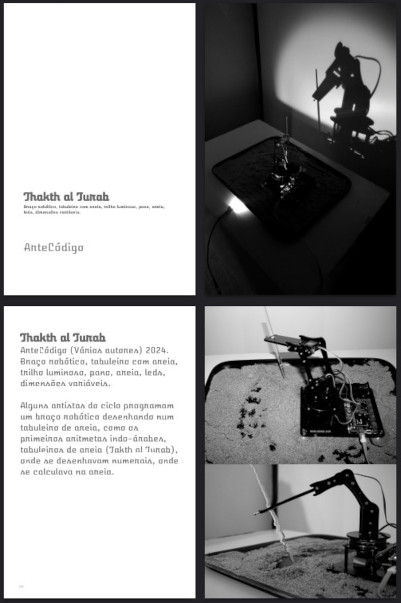

# Thakth al Turab
#### ArteCódigo (Vários autores), 2024-27.
Braço robótico, tabuleiro com areia, trilho luminoso, pano, areia, leds, dimensões variáveis.

Alguns artistas do ciclo programam um braço robótico desenhando num
tabuleiro de areia, como os primeiros aritmetas indo-árabes,
tabuleiros de areia (Takth al Turab), onde se desenhavam numerais, onde
se calculava na areia.

*in* ArteCódigo (2025), Calcular na Areia 2425, Santarém: ArteCódigo Publicações. AC22003, 205pp. ISBN 978-989-33-8051-2. URL https://artecodigo.pt/pub/

### Versão

0.3 -- ajustes na galeria

### Liçensa

[EUPL 1.2](https://eupl.eu/1.2/pt/)
